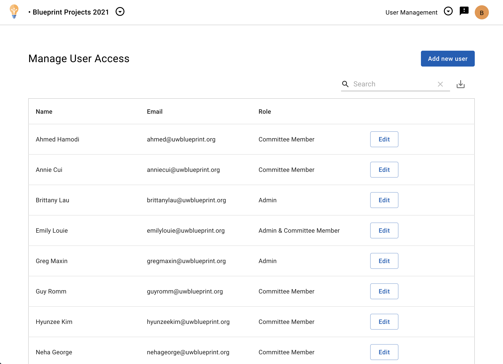

# Remove a user

## Things to keep in mind
- If the person had previously made any reviews (as an Admin & Committee Member or Committee Member), their reviews will continue to show in reports.
- You can always [re-add a user](add-users).
  - If you re-add them as a reviewer (Admin & Committee Member or Committee Member) and they had previously made reviews, they will be restored for the user.

## Remove a user from your program

1. Open the program you'd like to add someone to.
2. Click **User Management** in the top right dropdown.
    
3. Beside the user you want to edit, click **Edit**. A dialog should open.
4. Click **Remove access**, and then **Please confirm removal** to confirm.
    
